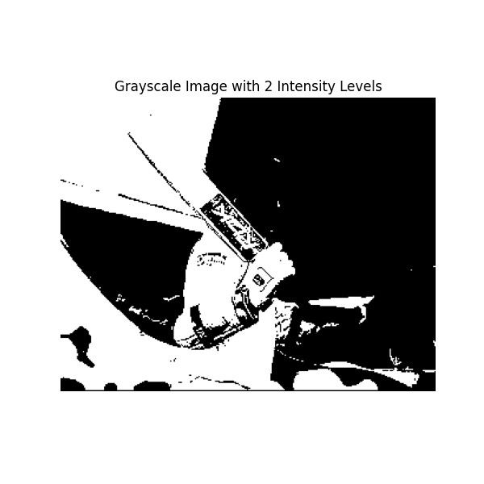
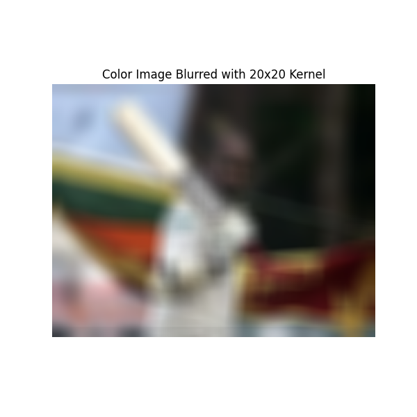
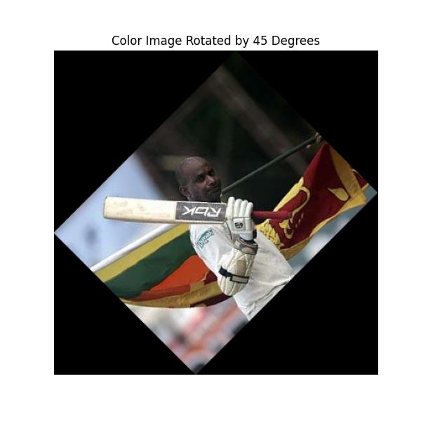
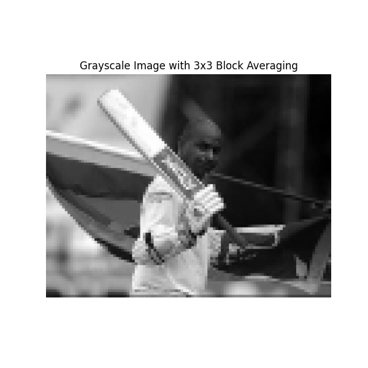

# EC7212 - Computer Vision and Image Processing - Assignment 1

This repository contains the Python implementations for Take Home Assignment 1 of the EC7212 Computer Vision and Image Processing course. The assignment focuses on fundamental image processing operations.

## Author

- **Name:** ABEYSEKARA P.K.
- **Registration No:** EG/2020/3799
- **Semester:** 07

## Assignment Overview

The assignment required implementing four main image processing tasks using Python, primarily with the OpenCV and NumPy libraries.

### Tasks Implemented:

1.  **Intensity Level Reduction:**
    -   Reduce the number of intensity levels in a grayscale image from 256 down to a variable number of levels (powers of 2, e.g., 128, 64, ..., 2).
2.  **Spatial Averaging (Blurring):**
    -   Perform spatial averaging on an image using different kernel sizes (3x3, 10x10, and 20x20) to achieve image blurring.
3.  **Image Rotation:**
    -   Rotate an image by 45 degrees and 90 degrees.
4.  **Block Averaging (Spatial Resolution Reduction):**
    -   Simulate the reduction of image spatial resolution by dividing the image into non-overlapping blocks (3x3, 5x5, 7x7) and replacing each block with its average pixel value.

## File Structure

```
.
├── results/ # Directory containing output images
│ ├── task-1/
│ │ ├── sanath_gray.png
│ │ ├── intensity_reduced_128_levels.png
│ │ └── ... (other output images for task 1)
│ ├── task-2/
│ │ ├── sanath_color.png
│ │ ├── blurred_color_3x3.png
│ │ └── ... (other output images for task 2)
│ ├── task-3/
│ │ ├── rotated_color_45_degrees.png
│ │ └── ... (other output images for task 3)
│ └── task-4/
│   ├── block_averaged_gray_3x3.png
│   └── ... (other output images for task 4)
├── sanath.png # Sample image used for processing
├── task1_intensity_reduction.py # Script for Task 1
├── task2_spatial_averaging.py # Script for Task 2
├── task3_rotate_image.py # Script for Task 3
├── task4_block_averaging.py # Script for Task 4
├── Assignment1_Report.pdf # The PDF report for the assignment
└── README.md # This file
```

## Requirements

To run the Python scripts, you need the following libraries:

-   Python 3.x
-   OpenCV (`opencv-python`)
-   NumPy (`numpy`)
-   Matplotlib (`matplotlib`)

You can install these dependencies using pip:
```bash
pip install opencv-python numpy matplotlib
```

## How to Run

1.  **Clone the repository (optional):**
    ```bash
    git clone https://github.com/PasanAbeysekara/EC7212-Assignment1
    cd EC7212-Assignment1
    ```
2.  **Ensure `sanath.jpg` (or your chosen sample image) is present** in the same directory as the scripts, or update the `IMAGE_PATH` variable within each script.
3.  **Run individual task scripts:**
    Open a terminal or command prompt, navigate to the directory containing the scripts, and execute them one by one:
    ```bash
    python task1_intensity_reduction.py
    python task2_spatial_averaging.py
    python task3_rotate_image.py
    python task4_block_averaging.py
    ```
    Each script will display the processed images using Matplotlib. Close the image windows to allow the script to proceed or complete. Output images may also be saved to disk if `cv2.imwrite` lines are uncommented in the scripts.

## Results

The output images generated by each task demonstrate the respective image processing operations. For a detailed analysis and presentation of results, please refer to the `Assignment1_Report.pdf` 

#### **Example Output Snippets (few images here):**

###### **Task 1: Intensity Reduction (2 Levels)**
  <!-- Update path if needed -->

###### **Task 2: Spatial Averaging (20x20 Kernel)**
 <!-- Update path if needed -->

###### **Task 3: Rotation**
 <!-- Update path if needed -->

###### **Task 4: Block Averaging (3x3)**
 <!-- Update path if needed -->


## Notes

-   The scripts are designed to be run independently for each task.
-   The `display_image` helper function uses Matplotlib for visualization.
-   The image paths for loading and saving might need adjustment based on your local setup if you deviate from the provided structure.

---

This README provides an overview of the project. For specific implementation details, refer to the Python code files and the submitted report.